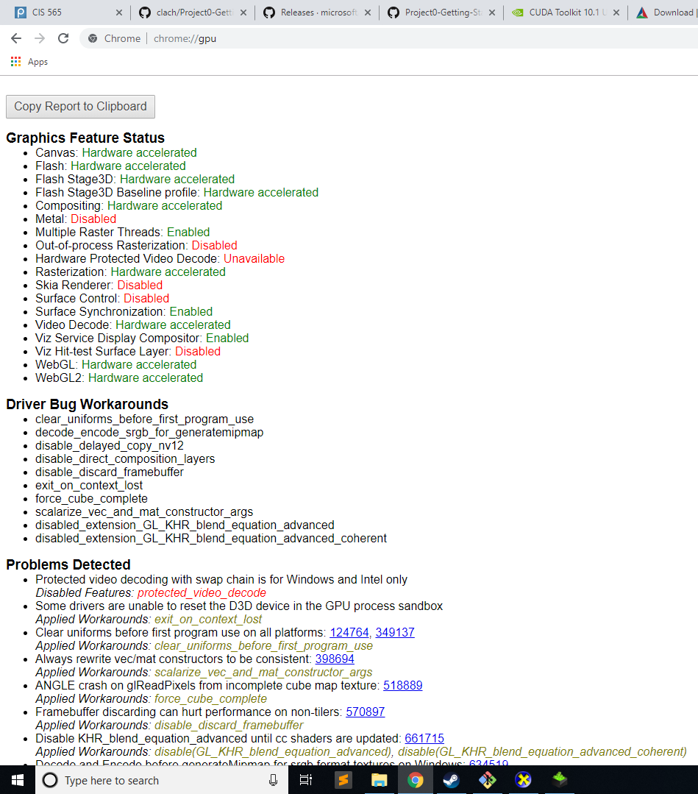
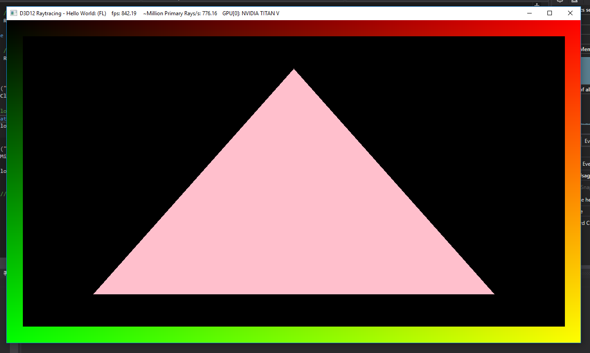
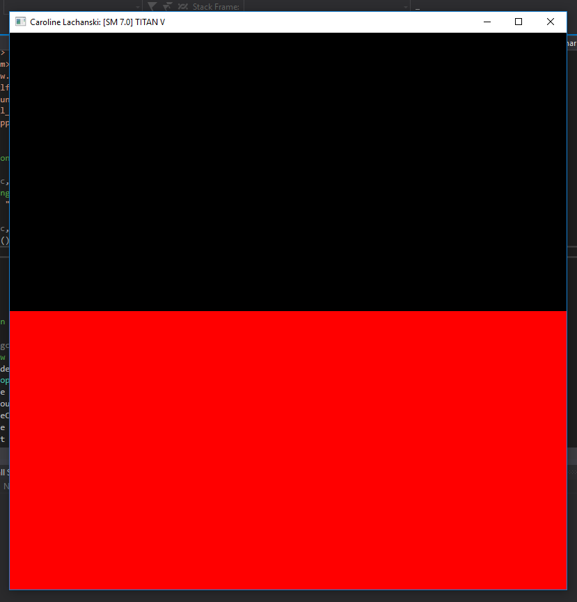
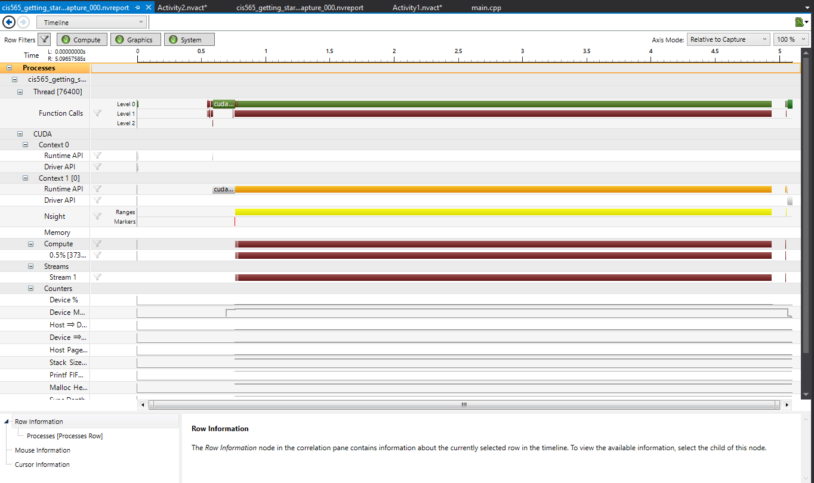
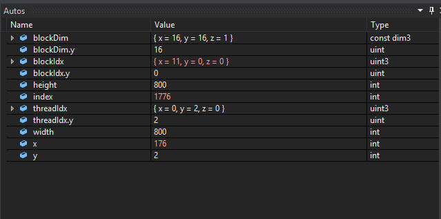
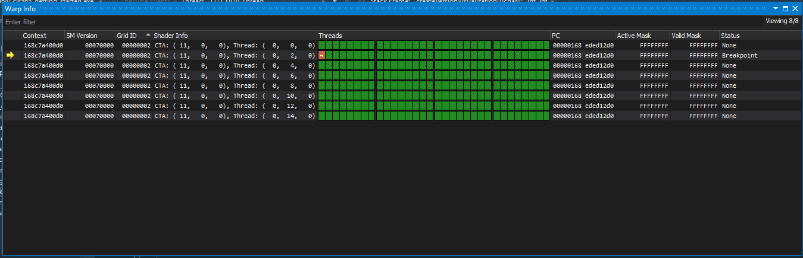

Project 0 Getting Started
====================

**University of Pennsylvania, CIS 565: GPU Programming and Architecture, Project 0**

* Caroline Lachanski
  * [LinkedIn](https://www.linkedin.com/in/caroline-lachanski/), [personal website](http://carolinelachanski.com/), etc.
* Tested on: Windows 10, E5-2687W v3 @ 3.10GHz, NVIDIA TITAN V 12 GB (SIGLab), though I hope to switch to a personal computer for the folowing assignments

### (TODO: Your README)

Part 2 output of chrome:\\gpu:

Part 2 modified triangle:

Part 4 with name:

Part 5 NSight Timeline:

Part 6 Autos:

Part 6 CUDA Warp Info:

